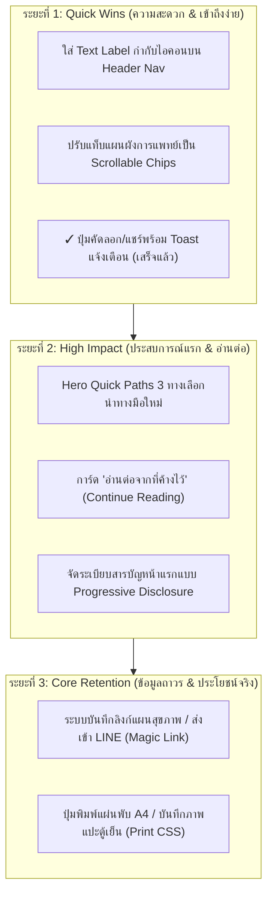

# แผนแม่บทการยกระดับประสบการณ์ผู้ใช้งาน (UX/UI & Retention Roadmap)
### สำหรับเว็บไซต์หนังสือสุขภาพ "ก่อนสมองจะป่วย & ก่อนสมองพัง" (Doctor V Health Portal)

> **บันทึกเมื่อ:** 4 กันยายน 2026  
> **ที่มา:** สรุปข้อเสนอแนะจากการทดสอบของผู้ใช้จริง (First-time User Perspective & Behavioral UX Analysis)

---

## 🎯 สรุปภาพรวมและวัตถุประสงค์ (Executive Summary)

ระบบปัจจุบันมีฐานการทำงานที่เสถียรทั้งการอ่าน 61 ตอน, ระบบค้นหาข้อความเต็ม, และแผนผังอินเตอร์แอคทีฟทางการแพทย์ แต่การจะยกระดับเว็บจากการเป็น **"คลังบทความ"** ไปสู่ **"Health Portal ที่ผู้ใช้ผูกพันและกลับมาใช้งานทุกวัน"** จำเป็นต้องปรับปรุง 5 ด้านหลัก:
1. **ลดภาระทางความคิดหน้าแรก (Reduce Cognitive Overload):** สร้างจุดนำทางแรก (Guided Onboarding) แทนที่จะปล่อยให้สารบัญและเครื่องมือแย่งความสนใจกัน
2. **ความต่อเนื่องในการอ่าน (Continue Reading):** ดึงข้อมูลเปอร์เซ็นต์การอ่านที่มีอยู่แล้ว มาแสดงให้ผู้ใช้กลับมาอ่านต่อได้ทันทีเพียงคลิกเดียว
3. **การเข้าถึงของผู้สูงอายุและมือใหม่ (Universal Accessibility):** เติม Text Label กำกับไอคอนบน Navbar ทั้งหมด
4. **ความคงทนและการพกพาของข้อมูล (Data Portability):** แก้ปัญหาข้อมูลแผน 7 วันและบุ๊กมาร์กสูญหายเมื่อเปลี่ยนเบราว์เซอร์ ด้วยระบบ Magic Link / Export
5. **คุณค่าเชิงสาธารณสุขในโลกจริง (Offline & Print Utility):** เพิ่มปุ่มพิมพ์แผ่นพับ A4 สำหรับแผนผังฉุกเฉิน (FAST Stroke) เพื่อแปะตู้เย็น

---

## 🗓️ แผนการพัฒนาแบ่งตามระยะ (Phased Execution)

---

## 📌 รายละเอียดการปรับปรุงแต่ละระยะ

### ระยะที่ 1: Quick Wins (ปรับปรุงด่วน ไม่กระทบโครงสร้างหลัก)
*เป้าหมาย: ผู้สูงอายุและผู้ใช้ใหม่เข้าใจปุ่มต่างๆ ทันที ลดการคลิกผิด และแก้จุดตกขอบบนมือถือ*

1. **เพิ่ม Text Label กำกับไอคอนบน Navbar (`Navbar.jsx` / `Header`):**
   - จอคอม/แท็บเล็ต: แสดงไอคอนพร้อมข้อความภาษาไทยกำกับชัดเจน เช่น:
     - 📖 `สารบัญ`
     - 📊 `แผนผังการแพทย์`
     - 📋 `แผน 7 วัน`
     - 🔍 `ค้นหา`
     - 🔖 `บุ๊กมาร์ก`
     - 🌓 `ธีม`
   - จอมือถือ: แสดง Tooltip หรือจัด Navigation Bar ด้านล่าง (Bottom Nav) ที่มี Label สั้นๆ ช่วยลดความสับสนสำหรับไอคอนชีพจร (`Activity`)
2. **แก้ไขแท็บแผนผังการแพทย์ล้นจอ (`MedicalDiagramsModal.jsx`):**
   - เปลี่ยนแถบแท็บด้านบนให้เป็น `display: flex`, `overflow-x: auto`, `white-space: nowrap` พร้อมซ่อน scrollbar ให้เนียนตา
   - เพิ่ม Left/Right Gradient Mask บ่งบอกว่าสามารถปัดซ้าย-ขวาได้ ทำให้แท็บที่ 5 "หลงลืมตามวัย VS สมองเสื่อม" มองเห็นได้ชัดเจนบนทุกขนาดหน้าจอ
3. **[ดำเนินการเสร็จแล้ว] ปุ่มแชร์และคัดลอก:**
   - มี Feedback ชัดเจน เปลี่ยนเป็นไอคอน `CheckCircle2` สีเขียว พร้อมข้อความ "✓ คัดลอกสรุปแล้ว!" ทันทีที่คลิก

---

### ระยะที่ 2: High Impact (ปรับแต่งหน้าแรก & สร้างประสบการณ์ต่อเนื่อง)
*เป้าหมาย: ผู้ใช้ใหม่ไม่เคว้งคว้าง และผู้ใช้เก่ากลับมาอ่านบทความขนาดยาวต่อได้ทันที*

1. **จุดนำทางด่วนสำหรับผู้ใช้ใหม่ (Smart Onboarding Hero Pathways):**
   - เพิ่มแถบนำทาง 3 เส้นทางเด่นใต้ Hero Banner:
     - 🚨 **มีอาการน่าสงสัย / ฉุกเฉิน?** → เปิดแผนผัง FAST Stroke ทันที
     - ⏱️ **ยังไม่รู้จะเริ่มตรงไหน?** → ทำแบบประเมินความเสี่ยงสมอง 2 นาที
     - 📚 **พร้อมเริ่มอ่านหนังสือ?** → แนะนำบทเริ่มต้น หรือเลือกอ่านเล่ม 1 / 2
2. **วิดเจ็ต "อ่านต่อจากที่ค้างไว้" (Continue Reading Banner):**
   - ตรวจจับประวัติจาก `localStorage` (`reading_progress_<id>`)
   - แสดงการ์ดเด่นบนหน้าแรกเมื่อผู้ใช้กลับมา:
     - ชื่อบทล่าสุด + เล่มที่
     - หลอดความคืบหน้า (เช่น "อ่านไปแล้ว 65%")
     - ปุ่ม **"อ่านต่อทันที"** → คลิกแล้วเปิดหน้านั้นพร้อมเลื่อนลงไปยังย่อหน้าที่ค้างไว้ทันที
3. **จัดระเบียบสารบัญ 61 ตอนหน้าแรก (Progressive Disclosure):**
   - ลดความยาวหน้าแรกจาก 61 การ์ดติดกัน:
     - ทำแท็บสลับระหว่าง `เล่มที่ 1 (39 ตอน)` และ `เล่มที่ 2 (22 ตอน)` ให้เลือกดูชัดเจน
     - แสดงเฉพาะหมวดสำคัญ พร้อมปุ่ม *"คลี่ดูสารบัญทั้งหมด"* เพื่อให้หน้าแรกกระชับ สะอาดตา และโหลดเร็วขึ้น

---

### ระยะที่ 3: Core Retention (การรักษาผู้ใช้ & ประโยชน์ในชีวิตจริง)
*เป้าหมาย: ฟีเจอร์สร้างพฤติกรรม (Habit Tracker) ใช้งานได้จริงโดยไม่ต้องพึ่งระบบ Login เซิร์ฟเวอร์*

1. **ระบบ Magic Link / ส่งออกข้อมูลแผน 7 วัน (Data Portability):**
   - **แนวคิด:** ไม่ต้องมีฐานข้อมูลหรือระบบสมัครสมาชิกให้ยุ่งยาก
   - **ปุ่ม "บันทึกลิงก์แผนของฉัน":** เข้ารหัสรายการที่ติ๊กและข้อความที่เพิ่มไว้ลงใน URL Hash (เช่น `https://doctorv-ch.vercel.app/#plan=eyJpdGVt...`)
   - **ฟังก์ชัน "ส่งเข้า LINE":** ให้ผู้ใช้กดปุ่มแชร์ลิงก์นี้ส่งเข้าห้องแชท LINE ของตัวเอง เมื่อเปิดจากโทรศัพท์เครื่องใด ข้อมูลแผน 7 วันจะถูกโหลดขึ้นมาทำงานต่อได้ทันที
   - **ปุ่ม Backup / Restore:** สามารถดาวน์โหลดเป็นไฟล์ JSON เล็กๆ หรือสแกน QR Code จากหน้าจอคอมเข้ามือถือได้
2. **ระบบพิมพ์แผ่นพับ A4 / บันทึกภาพอินโฟกราฟิก (Print & Export Infographic):**
   - เพิ่มปุ่ม 🖨️ **"พิมพ์แผ่นพับ A4"** และ 📥 **"บันทึกเป็นภาพ"** ที่มุมขวาบนของแผนผังการแพทย์
   - เขียน `@media print` CSS สำหรับแผนผัง FAST Stroke, หลงลืม VS สมองเสื่อม, และตารางการนอนหลับ ให้จัดหน้าพอดีกระดาษ A4 หน้าเดียว ไม่มีขอบดำ ไม่มีปุ่มรกตา
   - ตอบโจทย์คนไข้และลูกหลานที่ต้องการพิมพ์ติดตู้เย็น หรือมอบให้ผู้สูงอายุที่บ้านดูแบบออฟไลน์

---

## 📊 เมทริกซ์การประเมินและเปรียบเทียบ (Evaluation Matrix)

| ฟีเจอร์ | ผลกระทบต่อผู้ใช้ (Impact) | ความยากเชิงเทคนิค (Effort) | ความจำเป็นเร่งด่วน |
|---|:---:|:---:|:---:|
| 1. Text Label บน Navbar | สูง (สำหรับผู้สูงอายุ) | ต่ำ (1–2 ชม.) | ⭐⭐⭐⭐⭐ |
| 2. แก้แท็บแผนผังล้นจอ | ปานกลาง | ต่ำ (30 นาที) | ⭐⭐⭐⭐⭐ |
| 3. การ์ด "อ่านต่อจากที่ค้างไว้" | สูงมาก | ต่ำ-ปานกลาง (2–3 ชม.) | ⭐⭐⭐⭐⭐ |
| 4. Hero Quick Paths นำทางมือใหม่ | สูงมาก | ปานกลาง (3–4 ชม.) | ⭐⭐⭐⭐ |
| 5. บันทึกแผน 7 วันแบบ Magic Link | สูงมาก (กู้แผนข้ามเครื่อง) | ปานกลาง (3–4 ชม.) | ⭐⭐⭐⭐ |
| 6. พิมพ์ A4 ติดตู้เย็น (Print CSS) | สูง (การแพทย์ออฟไลน์) | ปานกลาง (2–3 ชม.) | ⭐⭐⭐ |

---

## 💡 สรุปขั้นตอนถัดไปเมื่อพร้อมเริ่มทำ
เมื่อต้องการเริ่มปรับปรุง สามารถแจ้งทีมพัฒนาได้ทันที โดยแนะนำให้เริ่มจาก **ระยะที่ 1 (Quick Wins: Text Labels & แท็บล้นจอ)** และ **ระยะที่ 2.2 (การ์ดอ่านต่อ)** ซึ่งใช้เวลาน้อยแต่เปลี่ยนโฉมความประทับใจของผู้ใช้ได้อย่างก้าวกระโดดครับ
